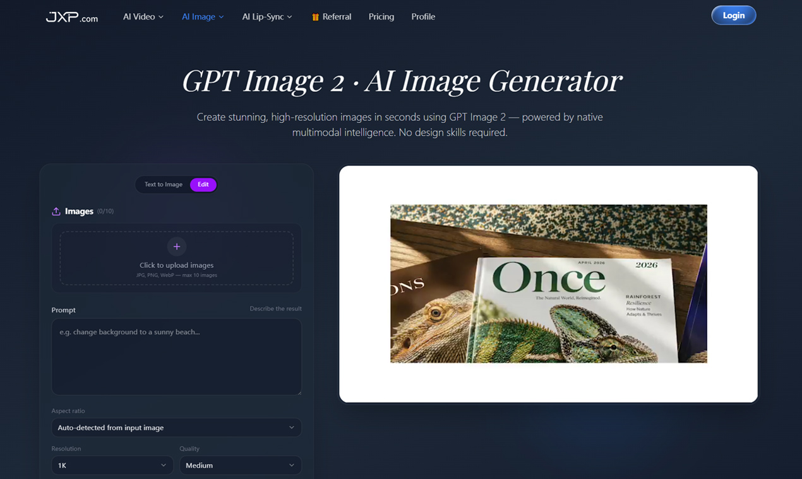

# GPT Image 2

## Creative Notes Overview

[GPT Image 2](https://www.jxp.com/gpt-image/gpt-image-2) feels useful when the goal is to move through visual directions quickly, compare outputs with less friction, and keep concept testing lightweight before deeper production work.

This repository uses a creative-notes theme instead of a generic landing-page structure. The page is meant to feel like a compact working reference for image ideation, prompt exploration, and review flow decisions.

## Working Note

A practical use pattern is to create several visual variations for the same concept, compare tone and framing, and only then refine the strongest option into a more polished asset.

## Prompt Reference

Create three visual directions for the same launch concept: minimal editorial, premium campaign, and bold social-first. Keep the subject clear, the lighting intentional, and the composition readable.

## Official Product Link

If you want the fuller workflow, examples, and current capabilities, explore the official [GPT Image 2 product page](https://www.jxp.com/gpt-image/gpt-image-2).

You can also review [GPT Image 2](https://www.jxp.com/gpt-image/gpt-image-2) as a fast first-pass tool before moving a concept into a more detailed production workflow.
